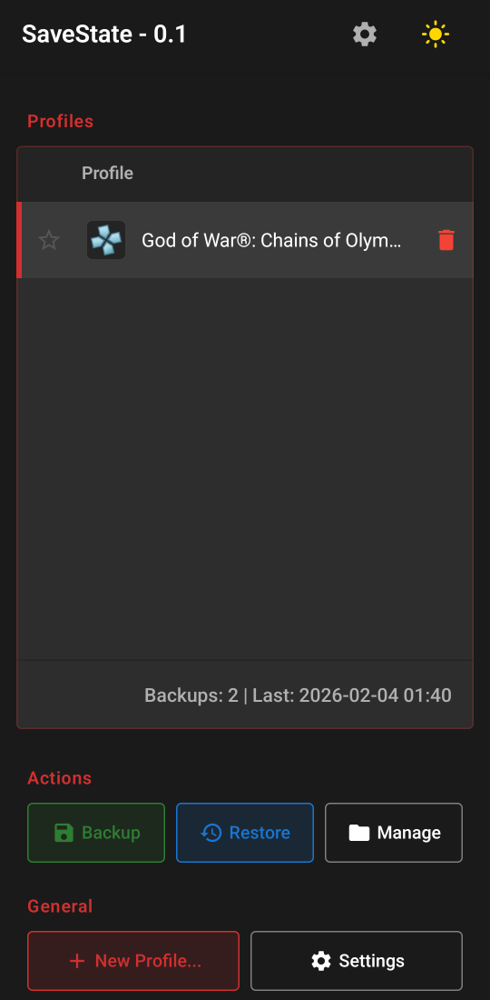

# SaveState - Android App

**Backup & Restore your emulator save files on Android**

> 🖥️ **Looking for the Desktop/PC version?** Check out [SaveState for Windows](https://github.com/Matteo842/SaveState)

---

## 📱 About

**SaveState App** is an Android application designed to backup and restore save files from **emulators**. Unlike the desktop version which targets PC games in general, this mobile app is specifically built for the Android emulator ecosystem.

### Current Status: `Pre-Release Alpha (v0.6)`

The app is **functional** and can be used to:
- ✅ Detect installed emulators
- ✅ Scan for game saves (folder- and file-level where needed)
- ✅ Create compressed backups (.zip)
- ✅ Restore saves from backups
- ✅ Manage multiple game profiles
- ✅ Persist data across app reinstalls (when using external storage)
- ✅ Optional **root mode** for saves under protected `Android/data/` paths

### What’s new in v0.6

- **Dolphin** (GameCube / Wii): backup and restore including **MMJR / MMJR2** variants; public paths under `dolphin-emu/` and, with **Root mode**, access to app-private storage.
- **DuckStation** (PS1): memcards and save states; **Root mode** for private app data when needed.
- **Root mode** (Settings): toggle to use root (via [libsu](https://github.com/topjohnwu/libsu)) for emulators that keep saves in inaccessible `Android/data/` locations. Requires a rooted device and granting superuser access.
- **Broader emulator coverage** in detection and default paths: Citra, Azahar, DraStic, Flycast, mGBA, Lemuroid, Pizza Boy, AetherSX2, Vita3K, Yuzu, Citron (see table below).
- **Settings**: max backups per profile, maximum source size (MB) for a single backup, and ZIP compression level.

## 🎮 Supported Emulators

Paths are preconfigured per emulator. Some titles only expose saves in **private app storage** on modern Android; for those, enable **Root mode** where indicated.

| Emulator | Platform | Notes |
|----------|----------|--------|
| **PPSSPP** | PSP | ✅ SAVEDATA + save states |
| **RetroArch** | Multi-system | ✅ Saves + runahead states |
| **Dolphin** | GameCube / Wii | ✅ Public + optional **root** for `Android/data/` |
| **DuckStation** | PS1 | ✅ Public + optional **root** for `Android/data/` |
| **Citra** / **Azahar** | 3DS | ✅ Default paths |
| **DraStic** | DS | ✅ |
| **Flycast** | Dreamcast | ✅ |
| **mGBA** | GBA | ✅ |
| **Lemuroid** | Multi-system | ✅ |
| **Pizza Boy** | GBA / GBC | ✅ |
| **AetherSX2** | PS2 | ✅ |
| **Vita3K** | PS Vita | ✅ |
| **Yuzu** / **Citron** | Switch | ✅ |

> Compatibility depends on where each emulator stores files on your device. If a game does not appear in the list, check the emulator’s save directory settings or use Root mode if saves are under `Android/data/`.

## 📸 Screenshots

  

## 🚀 Getting Started

1. **Install the APK** from the Releases page
2. **Select a backup folder** when prompted (this is where your backups will be stored)
3. **Add a profile** with the + button
4. **Select your emulator** from the detected list
5. **Choose a game** from the detected saves
6. **Backup** with one tap; use **Restore** to write saves back

If you use **Dolphin** or **DuckStation** and saves live only in private storage, open **Settings**, enable **Root mode**, and grant superuser when asked.

### Data Persistence

Your profiles and backups are saved to the folder you select. This means:
- ✅ Backups survive app uninstallation
- ✅ Reinstall the app and select the same folder to restore everything
- ✅ You control where your data is stored

## 🗺️ Roadmap

- [x] Support for more emulators (paths + detection; Dolphin / DuckStation with root where needed)
- [ ] Auto-backup scheduling
- [ ] Cloud backup integration (Google Drive, OneDrive)
- [ ] Import/Export profiles
- [ ] Multi-language support

## 🤝 Contributing

Feedback is welcome! Feel free to:
- Report bugs via [Issues](https://github.com/Matteo842/SaveState-App/issues)
- Suggest new features or emulator support
- Share your experience with the app

> ⚠️ **Note:** This project is developed with AI assistance. Due to this, I'm currently **not accepting pull requests** for code changes, as reviewing external code contributions is beyond my capacity. Thank you for understanding!

## 📄 License

This project is licensed under the **GNU General Public License v3.0** - see the [LICENSE](LICENSE) file for details.

---

**Created by [Matteo842](https://github.com/Matteo842)**

